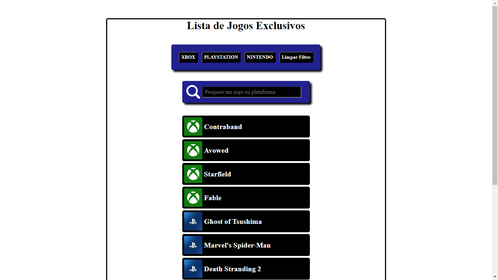
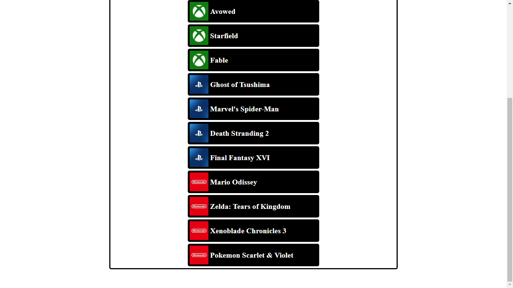
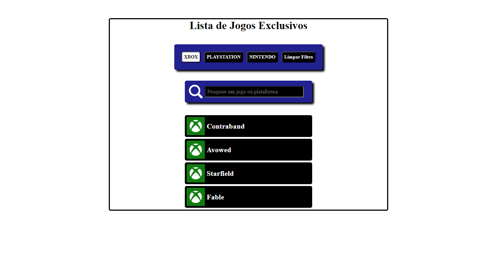
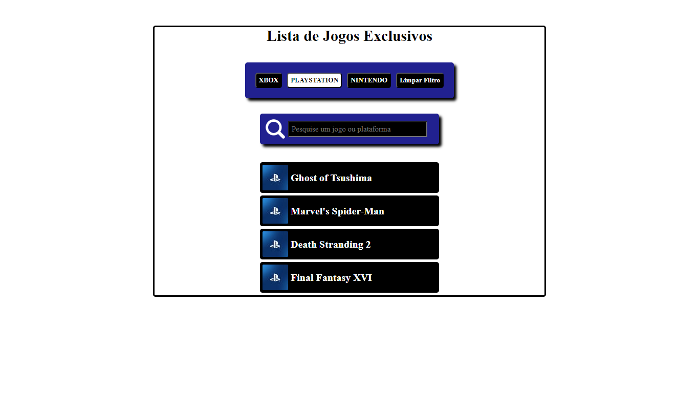
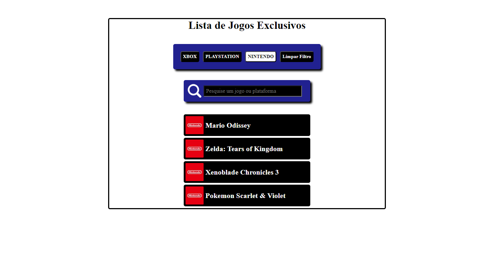
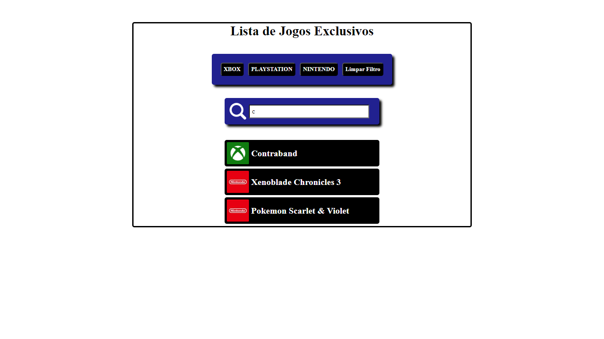

# Jogos Exclusivos

## 

## Jogos exclusivos, é um web site para mostrar as funcionalidades de trabalhar com coleção de dados tipo Array, e também utilizar Array.map e Array.filter. Através destas funcionalidades podemos pesquisar os jogos clicando em cima do botão da plataforma do jogo ou através da pesquisa, assim localizar o jogo desejado.
- Array.map é uma função nativa do JavaScript, o que significa que ela não precisa de importação, e pode ser usada diretamente.
- Array.filter também é uma função nativa do JavaScript, que serve para realizar buscas em uma coleção de dados.

## Objetivo.
- Criar um array de coleção de dados.
- Utilizar as funções nativas .map e .filter .
- Responsivo.

## Oque aprendi
- Coloquei em pratica as funcionalidades de coleção de dados tipo array, e também a utilizar as funções nativas map e filter, assim pude filtrar e selecionar os objetos dentro da coleção de dados.

### 
### 
### 
### 
### 
### 